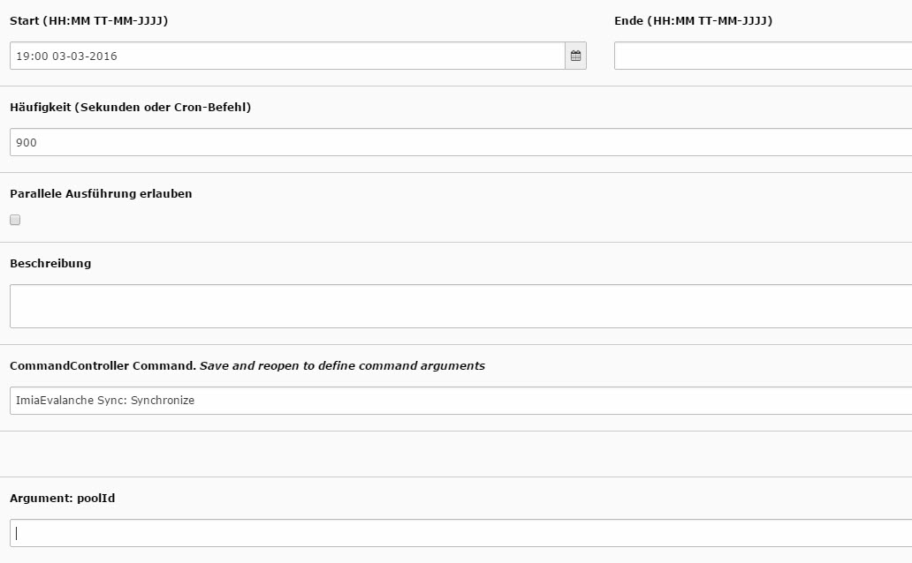

.. include:: ../Includes.txt

.. _admin-manual:

Administrator Manual
====================

Target group: **Administrators**

Describes how to manage the extension from an administrator point of view.
That relates to Page/User TSconfig, permissions, configuration etc.,
which administrator level users have access to.

Language should be non / semi-technical, explaining, using small examples.

.. _admin-installation:

Installation
------------

- How should the extension be installed?
- Are they dependencies to resolve?
- Is it a static template file to be included?

To install the extension, perform the following steps:

#. Go to the Extension Manager
#. Install the extension
#. Load the static template
#. ...

For a list of configuration options, using a definition list is recommended:

Some Configuration
  This option enables...

Other configuration
  This other option is for all the rest...

.. _admin-configuration:

Configuration
-------------

Synchronisation 
---------------

In jedem Typo3 CMS gibt es mindestens einen Administrator, welcher unter anderem die einzelnen Extensions vorkonfiguriert, damit die Redaktuere sie problemlos verwenden können. Ebenso gilt es bei der IMIA Evalanche Extension nach dem Download und der Installation einige wichtige Einstellungen zu berücksichtigen. Damit die Synchronisation der Benutzerdaten mit Evalanche erfolgen kann, muss in den Einstellungen der Extension der Login hinterlegt werden um einen Zugang zu der Evalanche Software zu ermöglichen. Dies umfasst die Evalanche-URL, den Nutzernamen und das Passwort.

.. figure:: ../Images/18-10-_2016_13-19-18.jpg
   :width: 500px
   :alt: Synchronisation
   

Durch die Einrichtung des Scheduler (Planer) im Typo3 Backend kann nun entschieden werden, wann ein automatisierter Synchronisationsvorgang vorgenommern wird. Hierbei wird ein neuer Task angelegt um Zielzeiten des Vorgangs zu wählen, die Häufigkeit der Synchronisation anzugeben oder parallele Ausführungen zu erlauben. Es gilt zu beachten dass in dem Auswahlmenü "CommandController Command" die ImiaEvalanche Sync ausgewählt wird, um die Synchronisation der richtigen Extension zu gewährleisten. Das Feld "Argument: poolID" dient hierbei zur genauen Identifikation des Pools in welchen die Kontakte gespeichert werden sollen in Evalanche. 

   
   
In einem globalen Ordner können nun sämtliche Kontakte und Benutzerdaten hinterlegt werden, welche an Evalanche übertragen werden sollen. Sobald bei der Bearbeitung des Ordners die Evalanche Sync in den Erweiterungen eingestellt wird, greift der Scheduler auf die Daten zu und synchronisiert alle Inhalte mit dem Evalanche-System und in den dafür vorgesehenen Pool.
