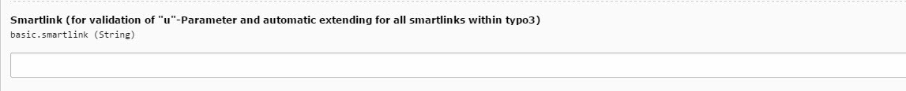

.. include:: ../Includes.txt

.. _admin-manual:

Administrator Anleitung
=======================

Eine Vorraussetzung zur Anwendung der IMIA Evalanche Extension ist die Installation der IMIA User Extension. Ohne diese Erweiterung ist die Übertragung und Synchronisation der Benutzerdaten mit Evalanche nicht möglich und die IMIA Evalanche Extension somit nicht korrekt verwendbar.

.. _admin-installation:

Installation
------------

Um die Extension zu installieren müssen folgende Schritte befolgt werde:

#. Auf "Erweiterungen" klicken
#. Nach "IMIA Evalanche" suchen und die Extension auswählen
#. Importieren und installieren

Konfiguration der Synchronisation 
----------------------------------
Der Administrator im TYPO3 CMS konfiguriert unter anderem die einzelnen Extensions vor, damit die Redakteure sie problemlos verwenden können. Ebenso gilt es bei der IMIA Evalanche Extension nach dem Download und der Installation einige wichtige Einstellungen zu berücksichtigen. Damit die Synchronisation der Benutzerdaten mit Evalanche erfolgen kann, muss in den Einstellungen der Extension der Login hinterlegt werden, um einen Zugang zu der Evalanche Plattform zu ermöglichen. Dies umfasst die Evalanche-URL, den Nutzernamen und das Passwort.

.. figure:: ../Images/18-10-_2016_13-19-18.jpg
   :width: 500px
   :alt: Synchronisation
   

Sobald die Einstellungen vorgenommen wurden, kann nun mit der Einrichtung des Scheduler (Planer) im TYPO3 Backend entschieden werden, wann ein automatisierter Synchronisationsvorgang mit den hinterlegten Logindaten vorgenommen wird. Hierfür muss ein neuer Task angelegt werden um Zielzeiten des Vorgangs zu wählen, die Häufigkeit der Synchronisation anzugeben oder parallele Ausführungen zu erlauben. Es gilt zu beachten dass in dem Auswahlmenü "CommandController Command" die "ImiaEvalanche Sync" ausgewählt wird, um die Synchronisation der richtigen Extension zu gewährleisten. Das Feld "Argument: poolID" dient hierbei zur genauen Identifikation, in welchem die Kontakte in Evalanche gespeichert werden sollen. 

.. figure:: ../Images/20-10-_2016_17-34-39.jpg
   :width: 500px
   :alt: Einstellungen Planer Task
   
   
In einem globalen Ordner können nun sämtliche Kontakte und Benutzerdaten hinterlegt werden, welche an Evalanche übertragen werden sollen. Sobald bei der Bearbeitung des Ordners die Evalanche Sync in den Erweiterungen eingestellt wird, greift der Scheduler auf die Daten zu und synchronisiert alle Inhalte mit dem Evalanche-System und in den dafür vorgesehenen Pool mit der angegebenen Nummer.

.. figure:: ../Images/18-10-_2016_15-16-23.jpg
   :width: 500px
   :alt: Einstellungen Synchronisation eines Ordners

.. _admin-configuration:

Konfiguration der Smartlinks
-----------------------------
Im Email-Marketing ist es unter anderem vom Vorteil zu erfahren von wo der User auf bestimmte Seiten zugreift oder auf welche Links er innerhalb einer Email geklickt hat. Um diese Informationen zu sammeln und nachverfolgen zu können, werden unter anderem Smartlinks eingesetzt. Hierdurch können Links mit den Benutzdaten des Users, welcher die Mail geöffnet hat, angereichert und getagt werden. Das Verhalten des Emailempfängers kann somit nachverfolgt und wertvolle Informationen gewonnen werden. Des Weiteren können durch die Smartlinks in Formularen spezielle Felder mit den übergebenen Benutzerdaten vorab automatisch ausgefüllt werden, sodass dem Kunde das Eingeben von immer gleichen Daten erspart wird. Mithilfe der IMIA Evalanche Extension kann sichergestellt werden das die Smartlinks korrekt eingebunden werden in die Email und das sie zudem auch gültig sind und keine Benutzerdaten verloren gehen. Somit können die Informationen verlustfrei an Evalanche übermittelt werden.

   
   
Um die Smartlinks zu konfigurieren muss in den Einstellungen der Extension in dem dafür vorgesehenen Feld ein Smartlink eingegeben werden. Dieser dient zum testen der übergebenen Benutzerparameter. Sind diese gültig, können die Parameter weiter verarbeitet und an zusätzliche Smartlinks getagt werden können. 
