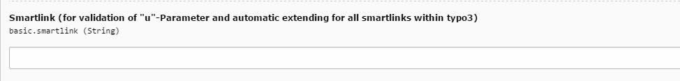

.. include:: ../Includes.txt

.. _configuration:

Konfiguration 
==============
Im Email-Marketing ist es unter anderem vom Vorteil zu erfahren von wo der User auf bestimmte Seiten zugreift oder auf welche Links er innerhalb einer Email geklickt hat. Um diese Informationen zu sammeln und nachverfolgen zu können, werden unter anderem Smartlinks eingesetzt. Hierdurch können Links mit den Benutzdaten des Users, welcher die Mail geöffnet hat, angereichert und getagt werden. Das Verhalten des Emailempfängers kann somit nachverfolgt und wertvolle Informationen gewonnen werden. Des Weiteren können durch die Smartlinks in Formularen spezielle Felder mit den übergebenen Benutzerdaten vorab automatisch ausgefüllt werden, sodass dem Kunde das Eingeben von immer gleichen Daten erspart wird. Mithilfe der IMIA Evalanche Extension kann sichergestellt werden das die Smartlinks korrekt eingebunden werden in die Email und das sie zudem auch gültig sind und keine Benutzerdaten verloren gehen. Somit können die Informationen verlustfrei an Evalanche übermittelt werden.

   
 
