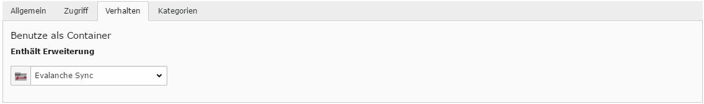

.. include:: ../Includes.txt

.. _developer:

Developer
==========

In jedem Typo3 CMS gibt es mindestens einen Administrator, welcher unter anderem die einzelnen Extensions vorkonfiguriert, damit die Redaktuere sie problemlos verwenden können. Auch bei der IMIA Evalanche Extension gibt es nach dem Download und der Installation einige wichtige Einstellungen zu berücksichtigen. Damit die Synchronisation der Benutzerdaten mit Evalanche erfolgen kann, muss in den Einstellungen der Extension der Login hinterlegt werden um einen Zugang zu der Evalanche Software zu ermöglichen. Dies umfasst die Evalanche-URL, den Nutzernamen und das Passwort.

.. figure:: ../Images/18-10-_2016_13-19-18.jpg
   :width: 500px
   :alt: Synchronisation
   

Durch die Einrichtung des Scheduler (Planer) im Typo3 Backend kann nun entschieden werden wann ein automatisierter Synchronisationsvorgang vorgenommern wird. Hierbei wird ein neuer Task angelegt um Zielzeiten des Vorgangs zu wählen, die Häufigkeit der Synchronisation anzugeben oder Parallele Ausführungen zu erlauben. Hierbei gilt zu beachten dass bei "CommandController Command" die ImiaEvalanche Sync ausgewählt wird um die Synchronisation der richten Extension zu gewährleisten. In einem globalen Ordner können nun sämtliche Kontakte und Benutzerdaten hinterlegt werden, welche an Evalanche übertragen werden sollen. Sobald in den Einstellungen des Ordner 

