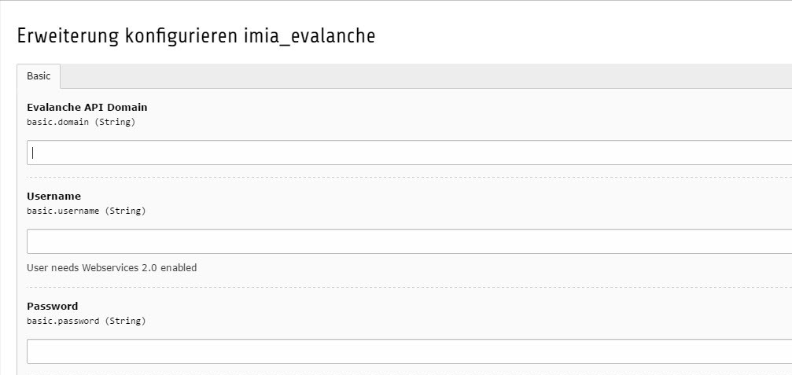

.. include:: ../Includes.txt

.. _developer:

Developer
==========

In jedem Typo3 CMS gibt es mindestens einen Administrator, welcher unter anderem die einzelnen Extensions vorkonfiguriert, damit die Redaktuere sie problemlos verwenden können. Auch bei der IMIA Evalanche Extension gibt es nach dem Download und der Installation einige wichtige Einstellungen zu berücksichtigen. Damit die Synchronisation der Benutzerdaten mit Evalanche erfolgen kann, muss in den Einstellungen der Extension der Login hinterlegt werden um einen Zugang zu der Evalanche Software zu ermöglichen.

