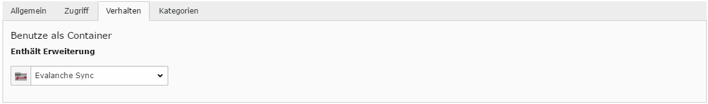

.. include:: ../Includes.txt

.. _einfuehrung:

Einführung
============

.. _Worum-geht-es:

Worum geht es?
----------------

Evalanche der Firma SC-Networks (http://www.sc-networks.de/) umfasst eine umfangreiche Lösung für Email-Marketing-Automation wodurch sich der hohe Aufwand bei der Planung und Durchführung von Email-Kampagnen minimieren lässt. Die Extension "IMIA Evalanche" stellt hierfür eine geeignete Schnittstelle zu dem CMS Typo3 zur Verfügung, sodass Evalanche vereinfacht verwendet und darauf zugegriffen werden kann. Überwiegend Agenturen und größere Unternehmen profitieren von der Einbindung von Evalanche und den vielen Vorteilen der Extension:

1. Es können eigene Formulare angelegt werden, welche von dem User ausgefüllt und die Parameter direkt an Evalanche weitergeleitet werden (ohne zusätzliches iFrame und unabhängig vom Typo3)     
2. Es findet eine automatisierte Synchronisierung von Benutzerdaten bzw. Kontakten statt, welche an Evalanche übertragen wird
3. automatische Anreicherung von Smartlinks mit Benutzerparametern

1. geeignete Formulare
--------------------------

2. automatische Synchronisierung
----------------------------------
Mit Hilfe der IMIA Evalanche können angelegte Benutzer in einem globalen Ordner verwaltet werden. Sobald der Ordner der Erweiterung "Evalanche Sync" zugewiesen ist, greift die Extension und synchronisiert automatisch die Daten auf die Evalanche Plattform. 

Die Synchronisation kann seperat eingestellt und angepasst werden, sodass der Administrator selbst bestimmen kann wann diese automatisiert durchgeführt wird. (siehe Administrator)
