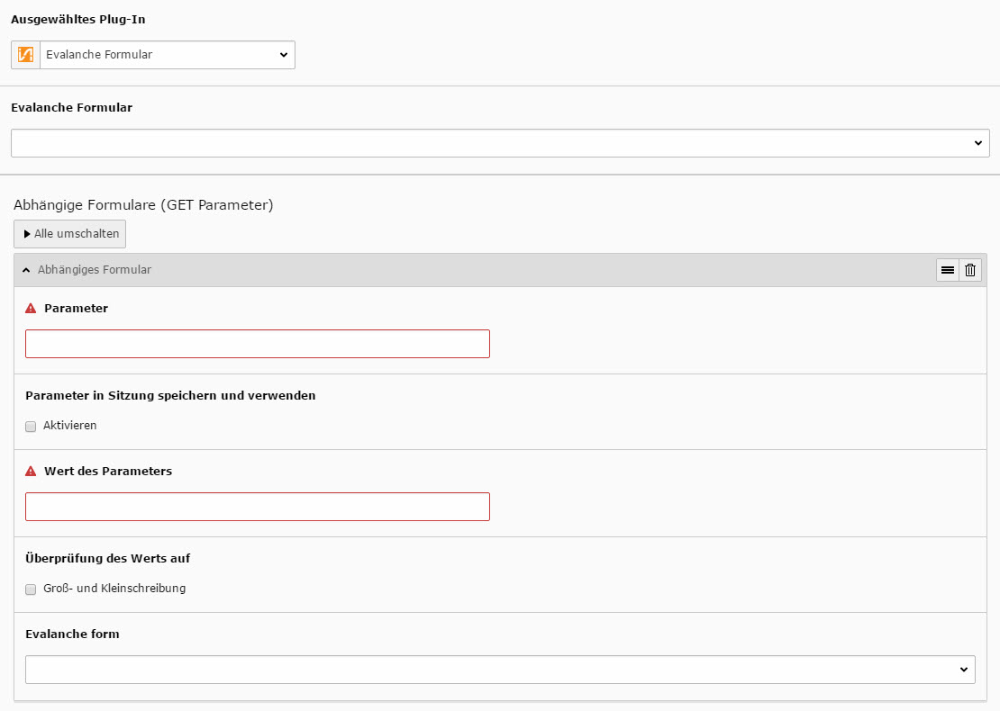
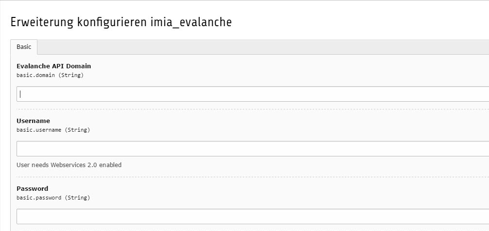

.. include:: ../Includes.txt

.. _einfuehrung:

Einführung
============

.. _Worum-geht-es:

Worum geht es?
----------------

Evalanche der Firma SC-Networks (http://www.sc-networks.de/) umfasst eine umfangreiche Lösung für Email-Marketing-Automation, wodurch sich der hohe Aufwand bei der Planung und Durchführung von Email-Kampagnen minimieren lässt. Die Extension "IMIA Evalanche" stellt hierfür eine geeignete Schnittstelle zu dem CMS Typo3 zur Verfügung, sodass Evalanche vereinfacht verwendet und darauf zugegriffen werden kann. Überwiegend Agenturen und größere Unternehmen profitieren von der Einbindung von Evalanche und den vielen Vorteilen der Extension:

1. Es können eigene Formulare angelegt werden, welche von dem User ausgefüllt und die Parameter direkt an Evalanche weitergeleitet werden (ohne zusätzliches iFrame und unabhängig vom Typo3)     
2. Es findet eine automatisierte Synchronisierung von Benutzerdaten bzw. Kontakten statt, welche an Evalanche übertragen wird
3. automatische Anreicherung von Smartlinks mit Benutzerparametern

1. Evalanche-Formulare
^^^^^^^^^^^^^^^^^^^^^^^^
Der Benutzer kann selbst im Content-Bereich bestimmen wo ein Formular eingefügt werden soll und ob es zu Evalanche weitergeleitet wird. Sobald er ein entsprechendes Formular gewählt hat, kann er als Redakteur sämtliche Felder anpassen oder sogar vorab automatisch befüllen.

   
   
Ebenso besteht die Möglichkeit ein vorab erstelltes Formular zu wählen und erneut zu verwenden. Alle Formulare können mit eigenen Styles und Scripten eingebunden und somit ganz individuell an die eigenen Wünsche angepasst werden. Sobald ein Kunde nun in dem Frontend seine Daten in das Formular einträgt und absendet, werden diese direkt an Evalanche weitergeleitet, ohne zusätzliche Zwischenspeicherung im Typo3 Backend. Ebenso ist kein zusätzliches iFrame nötig welches eingebunden werden müsste um die Daten zu übertragen. Alle geschieht automatisch dank der IMIA Evalanche Extension.

2. automatische Synchronisierung
"""""""""""""""""""""""""""""""""
Mit Hilfe der IMIA Evalanche können angelegte Benutzer in einem globalen Ordner verwaltet werden. Sobald der Ordner der Erweiterung "Evalanche Sync" zugewiesen ist, greift die Extension und synchronisiert automatisch die Daten auf die Evalanche Plattform. 

.. figure:: ../Images/18-10-_2016_15-16-23.jpg
   :width: 500px
   :alt: Synchronisierung einrichten

Die Synchronisation kann seperat eingestellt und angepasst werden, sodass der Administrator selbst bestimmen kann, wann diese automatisch durchgeführt wird. (siehe Administrator).\\ 
Eine unumgängliche Vorraussetzung zum Verwenden der Extension ist ein bestehendes Evalanche-Konto, da es notwendig ist in den Einstellungen der Erweiterung einmalig die Login-Daten für Evalanche zu hinterlegen. Die Synchronisierung kann somit alle Benutzerdaten die verwendet werden sollen für den Emailversand an Evalanche übertragen.

   
   
3. Anreicherung von Smartlinks
"""""""""""""""""""""""""""""""

