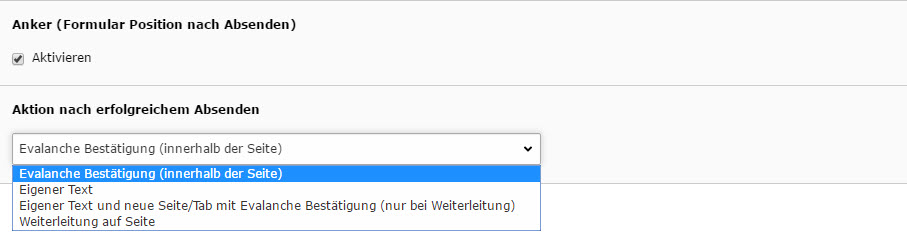

.. include:: ../Includes.txt

.. _user-manual:

Benutzeranleitung
==================

In Typo3 werden den Benutzern spezielle Rechte zugeordnet mit denen sie Webseiten inhaltlich befüllen können oder ganze Seiten erstellen. Durch die IMIA Evalanche Extension können Formulare (welche an Evalanche weitergeleitet werden sollen) simpel als Inhaltselement, innerhalb des Inhaltsbereiches, eingefügt werden. Über den Tab "Formulare" -> "Evalanche Formular" wird das Plugin aktiviert und kann bearbeitet werden. In der nun erschienenden Maske kann der Redakteur sämtliche Eingabefelder anpassen bzw neu erzeugen, welche der Kunde im Frontend ausfüllen soll.

.. figure:: ../Images/19-10-_2016_10-35-34.jpg
   :width: 500px
   :alt: Evalanche Formular

Desweiteren kann der Benutzer auch vorgespeicherte Formulare abändern (diese sind unter dem Dropdown-Menü "Evalanche Formular" zu finden).
Durch die hohe Anzahl an Entwürfen die hierbei entstehen können, ist es ebenso möglich verschiedene Styles für die Formulare und Emails auszuwählen. Hierbei können Kunden schneller unterscheiden ob zum Beispiel eine Rundmail intern innerhalb des Unternehmens versendet wird oder ob es sich um eine aktuelle Email zu einem speziellen Thema handelt. Diese erspart die immer wiederkehrende Erstellung von immer gleichen Layouts und spart somit Zeit und Geld. Des weiteren kann auch festeglegt werden was nach dem Absenden des Formulars geschehen soll.

Hierbei kann sogar gewählt werden ob der Kunde nach dem Absenden auf eine weitere Seite weitergeleitet werden soll, oder zum Beispiel auf der bestehenden Seite informiert wird, dass die Daten abgeschickt wurden. 
Nach dem Speichern ist das Formular sowohl im Backend als auch im Frontend sichtbar. Eine Einbindung eines iFrames von einem externen Anbieter oder sogar Evalanache ist hierbei überflüssig da sämtliche Dienste von der IMIA Evalanche Extension übernommen werden. Ebenso werden sämtliche Daten welche der Kunde im Frontend eingetragen hat über eine sichere Verbindung direkt an Evalanche weitergeleitet ohne im Typo3 Backend zwischengespeichert zu werden.
